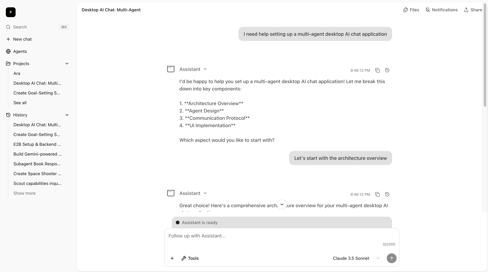
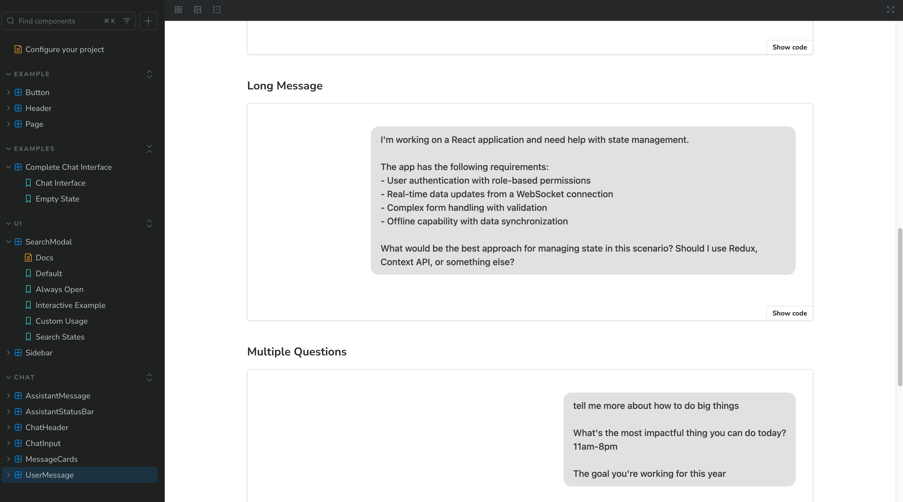

# Ara OS

Welcome to **Ara OS** - an open source interface to chat with AI & friends. This is the beginning of a new way to interact with AI assistants and collaborate with others in real-time.

## 🌟 Features

- **AI Chat Interface**: Clean, modern chat interface for conversing with AI assistants
- **Multi-Agent Support**: Built with extensibility in mind for multiple AI agents
- **Real-time Collaboration**: Foundation for chatting with friends alongside AI
- **Beautiful UI Components**: Powered by shadcn/ui with a polished design system
- **Storybook Integration**: Browse and test UI components in isolation

## 📸 Screenshots

### Chat Interface


### Storybook UI Components


## 🚀 Getting Started

First, install dependencies:

```bash
bun install
```

Then, run the development server:

```bash
bun run dev
```

Open [http://localhost:3000](http://localhost:3000) with your browser to see the result.

### Storybook

To explore the UI components in Storybook:

```bash
bun run storybook
```

This will open Storybook at [http://localhost:6006](http://localhost:6006).

## 🏗️ Tech Stack

- **Framework**: [Next.js 15](https://nextjs.org) with App Router
- **Language**: TypeScript
- **Styling**: Tailwind CSS v4
- **UI Components**: [shadcn/ui](https://ui.shadcn.com)
- **Package Manager**: [Bun](https://bun.sh)
- **Component Development**: [Storybook](https://storybook.js.org)

## 🎨 UI Components

Ara OS includes a comprehensive set of UI components:

- **Chat Components**: ChatInput, ConversationDisplay, MessageCard, and more
- **Navigation**: Sidebar with collapsible menu system
- **Core UI**: Buttons, Cards, Dialogs, Popovers, and other primitives
- **Animations**: Smooth transitions and fade-in effects

All components are documented and can be explored in Storybook.

## 🛠️ Development

The project structure follows Next.js App Router conventions:

```
app/
├── (with-sidebar)/     # Routes with sidebar layout
│   ├── chat/          # Chat interface
│   ├── agents/        # Agent management
│   ├── projects/      # Project views
│   └── dashboard/     # Dashboard
components/
├── chat/              # Chat-specific components
├── ui/                # Core UI components
└── ...                # Other shared components
```

## 🤝 Contributing

Ara OS is open source and welcomes contributions! Whether you're fixing bugs, adding features, or improving documentation, we'd love to have you involved.

## 📄 License

This project is open source and available under the [MIT License](LICENSE).

---

Built with ❤️ by the Ara OS community